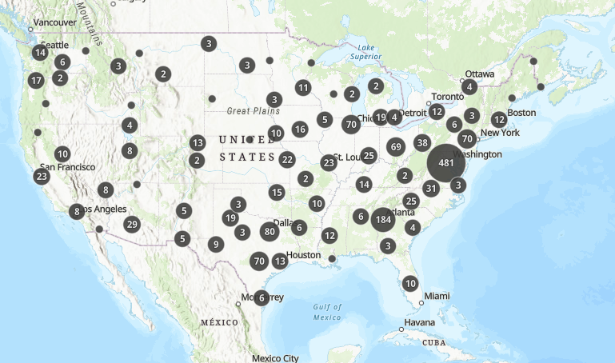
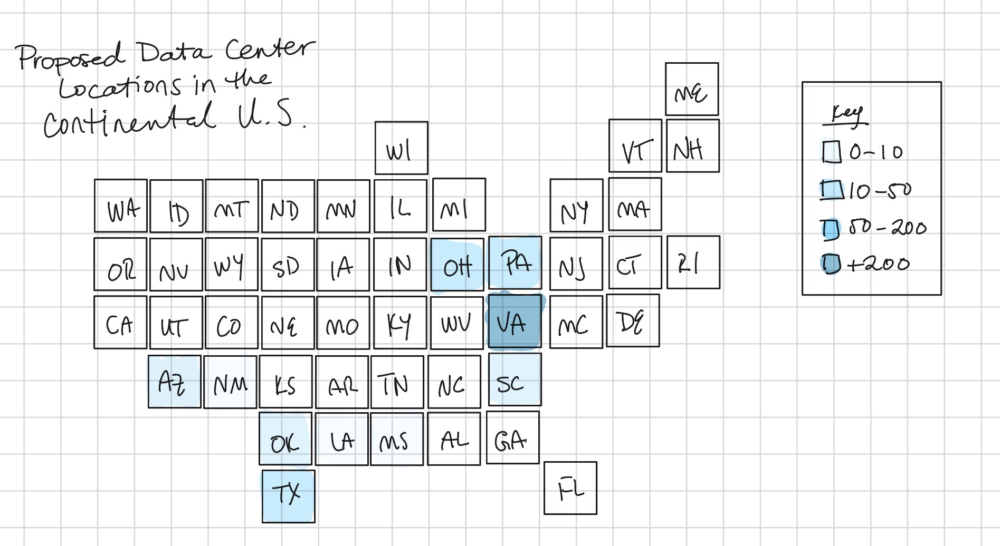

| [home page](https://cmustudent.github.io/tswd-portfolio-templates/) | [data viz examples](dataviz-examples) | [critique by design](critique-by-design) | [final project I](final-project-part-one) | [final project II](final-project-part-two) | [final project III](final-project-part-three) |

# Designing & Redesigning: Critique by Design Assignment

## Step one: the visualization

For our assignment this week, we participated in '[MakeoverMonday](https://makeovermonday.vercel.app/)', an online community project that gives participants the opportunity to "create better, more effective visualizations and help...make information more accessible." For the purposes of this assignment, I chose to rework a visualization of '[U.S. Data Center Locations](https://makeovermonday.vercel.app/dataset/us-data-center-locations)' (pictured below).

I chose to redesign this visualization because of the prevalence of data centers in both popular news media and nationwide political discussions. The average person in the United States has now heard a lot about data centers, but they may not know about how much more relevant they will become in their daily lives. 

## Step two: the critique

The original dataset and visualization is very utilitarian and dense. It shows the concentration of data centers in different regions in the continental United States through a bubble map (the larger the bubble, the more data centers in the area). It also includes the status of data centers including newly proposed, under construction, operational, and cancelled. In order to break down all that information, the viewer could filter by state, county, and status. You could also zoom in and out on the map and it would automatically filter the centers based on what part of the map was actually on screen at the time. 

This tool can be useful, depending on who is using it. For policymakers who may be seeking information on data centers in their district or for individuals doing a data center deep dive, this visualization is a great starting place for a lot of geographical data. However, I felt that it was too much information in one visualization for it to be truly successful for a broader audience. 

## Step three: Sketch a solution

Based on that idea, I decided to narrow the dataset to just include proposed data centers in different states in order to illustrate where data center growth is concentrated in the United States. I wanted to keep the geographic visualization aspect, but I wanted to simplify the map down into its most essential components so it would be easier on the eye. After some research, I settled on creating a tile map in Tableau.

## Step four: Test the solution

I presented the initial sketch (see above) to my classmates who gave me feedback that I was able to implement into my final visualization. While they found it to be much more clear and clean compared to the original, they were concerned about the contrasting color (or lack thereof) in my sketch. They also noted that there was potential for low visual interest since the map was so simplified. I wanted to keep these points in mind as I crafted the final product in Tableau. Taking all this into consideration, I wanted to focus on colors that weren't too overwhelming but also offered internal contrast while increasing the visual interest, leading me to wanting to create a hex tile map.

## Step five: build the solution

As I'm still very new to Tableau, I relied heavily on community blog posts about '[tile grid maps](https://www.tableau.com/blog/how-make-tiled-maps-tableau-45742)' and '[hex tile maps](https://www.sirvizalot.com/2015/11/hex-tile-maps-in-tableau.html)' (kudos to Brittany Fong and Matt Chambers for breaking this process down into easy-to-follow steps for a novice like me).

First, I had to filter the original dataset to just include the essential information (the number of proposed data centers by state). Then I used Matt's spreadsheet that aligned the tiles to build out the map in Tableau and combined that with the original dataset. After adjusting the size and format of the tiles and text within the workbook, I had a finished visualization!

<iframe
src="https://public.tableau.com/views/ProposedDataCentersintheUnitedStates/Sheet1?:showVizHome=no&:embed=true" width="90%" height="500" seamless frameborder="0" scrolling="no"></iframe>

