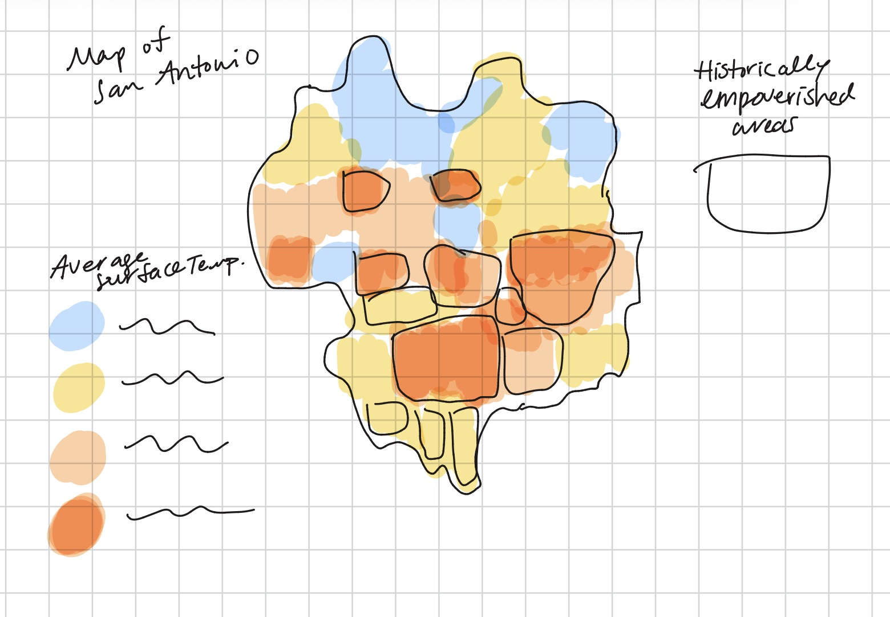

| [home page](https://cmustudent.github.io/tswd-portfolio-templates/) | [data viz examples](dataviz-examples) | [critique by design](critique-by-design) | [final project I](final-project-part-one) | [final project II](final-project-part-two) | [final project III](final-project-part-three) |

## Outline

With this project, I hope to further explore urban heat islands and its impact on vulnerable populations in San Antonio, TX. An urban heat island is a metropolitan area that is noticeably warmer than suburban or rural areas that are proximate to the urban center. The effect is primarily due to heat absorption and retention by human-made infrastructure (i.e. buildings and roads). According to the Environmental Protection Agency, cities are typically 1-7 degrees Fahrenheit warmer during the day when compared to nearby non-urban areas (EPA 2026). While urban heat islands can occur in any large city, it is particularly dangerous in a more humid region like San Antonio.

Urban heat negatively affects everyone; however, it doesn't affect everyone equally. More often than not, the young, the old, the chronically ill, and the economically disadvantaged all feels the effects of heat to a deeper degree than individuals who don't belong to those groups. This reality is reflected in worse health outcomes for those populations (WHO 2026). For the purposes of this project, I want to illustrate the relationship between historical disenfranchisement of poor communities in San Antonio and modern neighborhood temperatures.
 
# The "why"

Heat and humidity are constants in the lives of many San Antonians. It's a fact of life, the same as death and taxes. I, along with many of my fellow Texans, know this to be absolutely true. However, it wasn't until I became interested in the impacts of climate change in my community that I started to see heat a bit differently. I learned about the legacy of redlining and similar practices in the United States and how its still impacting poor communities and communities of color (Anderson 2020). I also realized how those patterns were mirrored in my own city. I want to showcase how urban heat is exacerbated by these historical practices, thereby increasing the vulnerability of already vulnerable socioeconomic groups.

## Initial sketch of heat map

I find that geospatial data visualizations are especially helpful and easy to understand for the average person. Many San Antonians are as familiar with the map of the city and its neighborhoods as we are with the back of our own hand. Each district has its own unique characteristics and history, so I felt that keeping it simple with a heat map would be best for the project. This is, of course, subject to change as the project matures!

Above all, I wanted to ensure clarity and simplicity for the sake of messaging which is why I want to utilize a gradient of contrasting colors to illustrate surface temperature alongside the indicators of disenfranchisement (i.e. outlines of historically poor communities and/or areas with large populations of people of color). 

# The data

I plan to utilize three main data sources for this project. The first is Landsat Data from the U.S. Geological Survey in order to capture current surface temperature in different neighborhoods within San Antonio. The data is publicly available via '[EarthExplorer](https://earthexplorer.usgs.gov/)', but it is tricky to download without crashing my laptop. I also plan to utilize data from the CDC's '[Social Vulnerability Index (SVI)](https://www.atsdr.cdc.gov/place-health/php/svi/index.html)' as it contains information on social vulnerability markers broken down by '[county](TEXAS_COUNTY.csv.xlsx)' and '[ZIP code](TEXAS_ZCTA.csv)'. I can use these data sets to compare general vulnerability levels in San Antonio to those within specific ZIP codes throughout the city.

# Method and medium

In order to complete this project, I would like to utilize Shorthand and Tableau. I have become more comfortable using the latter for the purposes of this course and would like to improve my skills further. I am, however, not familiar at all with Shorthand and will need to familiarize myself with it. I do think using ArcGIS Story Maps would also be a good option, but I have never used ArcGIS before and some self-teaching would probably be required. Either way, there will be a learning curve that I will have to overcome in some fashion. 

## References

Anderson, Meg. 2020. “Racist Housing Practices From The 1930s Linked To Hotter Neighborhoods Today.” Heat and Health in American Cities. NPR, January 14. '(https://www.npr.org/2020/01/14/795961381/racist-housing-practices-from-the-1930s-linked-to-hotter-neighborhoods-today)'.

Centers for Disease Control and Prevention/ Agency for Toxic Substances and Disease Registry/ Geospatial Research, Analysis, and Services Program. CDC/ATSDR Social Vulnerability Index 2022 Database Texas. '(https://www.atsdr.cdc.gov/placeandhealth/svi/data_documentation_download.html)'.

Earth Resources Observation and Science (EROS) Center. (2021). Landsat 4-9 U.S. Analysis Ready Data, Collection 2 TM C2 L2. U.S. Geological Survey. '(https://doi.org/10.5066/P960F8OC)'.

Hashemi, Farzad, and Mahsa Adib. 2024. “Examining Thermal Inequities: Land Surface Temperature, Social Vulnerability, and Historical Redlining in San Antonio, TX.” Urban Climate 55 (May): 15. '(https://doi.org/10.1016/j.uclim.2024.101960)'.

US EPA, OAR. 2014. “What Are Heat Islands?” Overviews and Factsheets. June 17. '(https://www.epa.gov/heatislands/what-are-heat-islands)'.

WHO. 2026. “Heat and Health.” World Health Organization, July 31. '(https://www.who.int/news-room/fact-sheets/detail/climate-change-heat-and-health)'.
